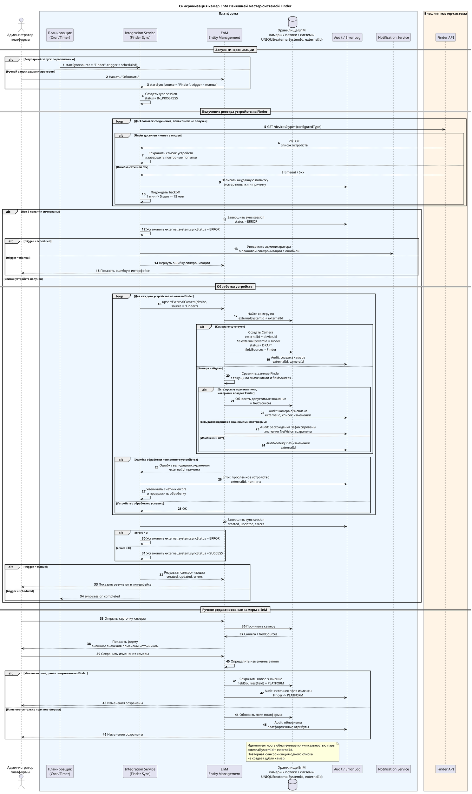

# NetVision

## Документация по интеграции с внешними системами

### 1. Введение

#### 1.1. Цель документации

Документ описывает технические особенности интеграции NetVision с внешними системами-источниками:

- расширение карточки и списка камер данными, полученными извне;
- интерфейс управления внешними системами и историей синхронизаций;
- модель данных для хранения систем-источников, статусов и логов синхронизации;
- правила создания и обновления камер при регулярной и ручной синхронизации;
- API для управления интеграциями.

#### 1.2. Цель доработки

Доработка нужна, чтобы NetVision мог получать камеры из внешних мастер-систем, создавать новые карточки камер и обновлять существующие записи по стабильному внешнему идентификатору.

#### 1.3. Особенности интеграции

- Интеграция односторонняя: данные загружаются из внешних систем в NetVision.
- NetVision не отправляет изменения камер обратно во внешние системы.
- Камера сопоставляется с внешней записью по паре `externalSystemId` + `externalId`.
- Повторная синхронизация должна быть идемпотентной: один и тот же внешний объект не создает дубликаты камер.
- Поля, полученные из внешней системы, доступны в интерфейсе с указанием источника значения, а правила обновления определяются политикой владения полями.
- Если поле изменено вручную в NetVision, оно считается значением платформы и не перезаписывается последующими синхронизациями без отдельного правила разрешения конфликтов.

### 2. Термины и общие правила

| Термин | Описание |
| --- | --- |
| Внешняя система | Система-источник, из которой NetVision получает данные о камерах. |
| External ID | Идентификатор объекта во внешней системе. Уникален в пределах конкретной внешней системы. |
| Система-источник | Запись справочника `external_system`, определяющая источник данных. |
| Внешнее поле | Атрибут камеры, значение которого получено из внешней системы. |
| Поле платформы | Атрибут камеры, созданный или измененный пользователем в NetVision. |
| Синхронизация | Процесс получения устройств из внешней системы и применения изменений в NetVision. |

#### 2.1. Правила владения полями

| Сценарий | Правило |
| --- | --- |
| Новая камера получена из внешней системы | NetVision создает карточку камеры, заполняет `externalId`, `externalSystemId`, статус и доступные внешние поля. |
| Повторная синхронизация нашла новое значение для пустого поля | Значение заполняется, поле помечается источником внешней системы. |
| Повторная синхронизация получила значение для поля, уже измененного в NetVision | Значение NetVision сохраняется, внешнее значение фиксируется как расхождение в логе синхронизации. |
| Пользователь вручную меняет поле, ранее полученное извне | Изменение сохраняется, источник поля становится `PLATFORM`; поле остается доступным для редактирования. |
| Внешняя система не прислала ранее известное поле | Значение в NetVision не очищается автоматически, событие может фиксироваться в аудите. |

### 3. Модель данных и интерфейсы

#### 3.1. Расширение карточки камеры

Карточка камеры дополняется системными полями интеграции. Они отображаются в режиме просмотра и редактирования, но заполняются системой.

##### Грид дополнительных полей камеры

| Наименование поля | Значение | Тип | Обязательность | Отображение | Заполнение |
| --- | --- | --- | --- | --- | --- |
| ID | Системный идентификатор камеры в NetVision | UUID, только чтение | Да, системное | Всегда | Генерируется системой при создании |
| External ID | Внешний идентификатор из системы-источника | Строка, только чтение | Нет | Всегда, при отсутствии отображается `-` | Заполняется системой при интеграции |
| Система-источник | Наименование записи из справочника `external_system` | Строка, только чтение | Нет | Всегда, при отсутствии отображается `-` | Заполняется системой при интеграции |
| Статус | Состояние готовности камеры к работе | Enum, только чтение | Да | Всегда | Устанавливается системой или бизнес-процессом |

##### Статусы камеры

| Статус | Название на UI | Описание | Когда устанавливается |
| --- | --- | --- | --- |
| `DRAFT` | Черновик | Камера создана, но требует настройки перед использованием. | При создании камеры из внешней системы, если данных недостаточно для работы. |
| `CONFIGURED` | Настроено | Камера готова к работе. | После заполнения обязательных параметров и успешной настройки. |

#### 3.2. Расширение списка камер

| Поле | Тип поля | Фильтрация | Сортировка | Отображение |
| --- | --- | --- | --- | --- |
| External ID | Строка | Да | Да | Внешний идентификатор; если отсутствует - `-` |
| Система-источник | Строка | Да | Да | Наименование внешней системы; если отсутствует - `-` |
| Статус | Enum | Да | Да | Плашка статуса камеры |

#### 3.3. Интерфейс управления внешними системами

Новый раздел "Внешние системы" предназначен для просмотра систем-источников, включения регулярной синхронизации, ручного запуска синхронизации и просмотра истории.

##### Поля грида "Внешние системы"

| Наименование поля | Тип | Поиск | Сортировка | Отображение |
| --- | --- | --- | --- | --- |
| Наименование | Строка | Да | Да | Текстовое название источника |
| Описание | Строка | Да | Нет | Краткое описание; если отсутствует - `-` |
| Включена | Boolean | Нет | Да | Переключатель `on / off` |
| Статус | Enum | Нет | Да | Плашка статуса: `IDLE`, `IN_PROGRESS`, `SUCCESS`, `ERROR` |
| Последняя синхронизация | Дата и время | Нет | Да | Формат `ДД.ММ.ГГГГ, ЧЧ:ММ`; если нет - `-` |
| Создан | Дата и время | Нет | Да | Формат `ДД.ММ.ГГГГ, ЧЧ:ММ` |
| Действия | Набор действий | Нет | Нет | Кнопки и меню действий |

##### Действия в гриде "Внешние системы"

| Наименование элемента | Тип | Отображение на экране | Активность | Действие |
| --- | --- | --- | --- | --- |
| Переключатель "Включена" | Toggle | В колонке "Включена" | Активен всегда, кроме момента сохранения изменения | Включает или отключает регулярную синхронизацию |
| Обновить | Кнопка | В колонке "Действия" | Активна, если источник включен и синхронизация не выполняется | Запускает принудительную синхронизацию |
| Поля | Кнопка | В колонке "Действия" | Активна всегда | Открывает модальное окно со списком полей, которые приходят из выбранной внешней системы, и правилами их обновления |
| Меню "Еще" | Кнопка-меню | Иконка `...` в колонке "Действия" | Активна всегда | Открывает выпадающее меню дополнительных действий |
| Редактировать | Пункт меню | В выпадающем меню "Еще" | Активен всегда | Открывает форму изменения наименования и описания системы |
| История синхронизаций | Пункт меню | В выпадающем меню "Еще" | Активен всегда | Открывает историю синхронизаций источника |
| Закрыть | Кнопка | В модальном окне | Активна при открытом модальном окне | Закрывает модальное окно |
| Клик вне модального окна | Область закрытия | Затемненный фон вокруг модального окна | Активен при открытом модальном окне | Закрывает модальное окно |

##### Модальное окно "Поля системы"

| Поле | Тип | Описание |
| --- | --- | --- |
| Наименование поля | Строка | Название поля камеры в NetVision |
| Внешнее поле | Строка | Название поля во внешней системе |
| Источник | Строка | Наименование внешней системы |
| Правило обновления | Строка | Например: "заполнять пустые значения", "не перезаписывать значения платформы" |
| Последнее значение | Строка | Последнее значение, полученное из внешней системы; если отсутствует - `-` |

#### 3.4. Форма "История синхронизаций"

##### Сводные показатели

| Наименование поля | Тип | Поиск | Сортировка | Отображение |
| --- | --- | --- | --- | --- |
| Получено устройств | Блок "наименование + общая сумма" | Нет | Нет | Общее число полученных устройств, по умолчанию `0` |
| Создано камер | Блок "наименование + общая сумма" | Нет | Нет | Общее число созданных камер, по умолчанию `0` |
| Обновлено камер | Блок "наименование + общая сумма" | Нет | Нет | Общее число обновленных камер, по умолчанию `0` |
| Количество ошибок | Блок "наименование + общая сумма" | Нет | Нет | Общее число ошибок, по умолчанию `0` |

##### Грид истории синхронизаций

| Наименование поля | Тип | Поиск | Сортировка | Отображение |
| --- | --- | --- | --- | --- |
| ID | BIGINT | Нет | Да | Число |
| Начало синхронизации | Timestamp | Да, по периоду | Да | Формат `ДД.ММ.ГГГГ, ЧЧ:ММ` |
| Конец синхронизации | Timestamp | Да, по периоду | Да | Формат `ДД.ММ.ГГГГ, ЧЧ:ММ`; если синхронизация не завершена - `-` |
| Статус | Enum | Да | Да | `IN_PROGRESS`, `SUCCESS`, `ERROR` |
| Получено устройств | Integer | Нет | Да | Число, по умолчанию `0` |
| Создано камер | Integer | Нет | Да | Число, по умолчанию `0` |
| Обновлено камер | Integer | Нет | Да | Число, по умолчанию `0` |
| Количество ошибок | Integer | Нет | Да | Число, по умолчанию `0` |
| Детали ошибок | JSON | Да | Нет | Краткий текст или JSON ошибки; полный текст доступен в tooltip или раскрытии строки |

### 4. Модель данных БД

#### 4.1. Таблица `external_system`

Справочник систем-источников.

| Наименование атрибута | Описание | Название поля на UI | Тип | Ограничения |
| --- | --- | --- | --- | --- |
| `id` | Внутренний суррогатный ключ | - | `UUID` | `PK`, `NOT NULL` |
| `name` | Уникальное название системы-источника | Наименование | `VARCHAR(255)` | `UNIQUE`, `NOT NULL` |
| `description` | Произвольное описание системы | Описание | `TEXT` | `NULLABLE` |
| `isActiveSync` | Активна ли регулярная синхронизация | Включена | `BOOLEAN` | `NOT NULL`, `DEFAULT false` |
| `syncStatus` | Текущий статус синхронизации | Статус | `VARCHAR(20)` | `NOT NULL`, `DEFAULT 'IDLE'` |
| `syncDate` | Время завершения последней синхронизации | Последняя синхронизация | `TIMESTAMPTZ` | `NULLABLE` |
| `createdAt` | Дата и время создания записи | Создан | `TIMESTAMPTZ` | `NOT NULL`, `DEFAULT NOW()` |
| `updatedAt` | Дата и время последнего изменения | Обновлен | `TIMESTAMPTZ` | `NOT NULL`, `DEFAULT NOW()` |

#### 4.2. Таблица `external_system_sync_log`

Лог сессий синхронизации.

| Атрибут | Тип | Ограничения | Описание |
| --- | --- | --- | --- |
| `id` | `BIGINT` | `PK` | Идентификатор записи |
| `externalSystemId` | `UUID` | `FK -> external_system.id`, `NOT NULL` | Ссылка на источник |
| `status` | `VARCHAR(20)` | `NOT NULL` | Статус сессии: `IN_PROGRESS`, `SUCCESS`, `ERROR` |
| `syncStartedAt` | `TIMESTAMPTZ` | `NOT NULL` | Начало синхронизации |
| `syncFinishedAt` | `TIMESTAMPTZ` | `NULLABLE` | Конец синхронизации |
| `totalReceived` | `INT` | `NOT NULL`, `DEFAULT 0` | Получено устройств |
| `created` | `INT` | `NOT NULL`, `DEFAULT 0` | Создано новых камер |
| `updated` | `INT` | `NOT NULL`, `DEFAULT 0` | Обновлено камер |
| `errors` | `INT` | `NOT NULL`, `DEFAULT 0` | Количество ошибок |
| `errorDetails` | `JSONB` | `NULLABLE` | Детали ошибок и расхождений |

#### 4.3. Расширение таблицы камер

| Атрибут | Тип | Ограничения | Описание |
| --- | --- | --- | --- |
| `externalId` | `VARCHAR(255)` | `NULLABLE` | Идентификатор камеры во внешней системе |
| `externalSystemId` | `UUID` | `FK -> external_system.id`, `NULLABLE` | Система-источник камеры |
| `fieldSources` | `JSONB` | `NULLABLE` | Метаданные источников значений по полям камеры |

Для идемпотентности требуется уникальный индекс:

```sql
CREATE UNIQUE INDEX ux_camera_external_source
ON camera ("externalSystemId", "externalId")
WHERE "externalSystemId" IS NOT NULL AND "externalId" IS NOT NULL;
```

#### 4.4. Статусы синхронизации `external_system.syncStatus`

| Статус | Название на UI | Описание | Когда устанавливается |
| --- | --- | --- | --- |
| `IDLE` | Ожидание | Система ожидает следующего цикла по расписанию. | Начальное состояние до первой синхронизации или после сброса расписания. |
| `IN_PROGRESS` | В процессе | Выполняется опрос внешней системы и обработка данных. | При старте автоматической или ручной синхронизации. |
| `SUCCESS` | Успешно | Последняя синхронизация завершилась без критических ошибок. | После успешного завершения обработки устройств. |
| `ERROR` | Ошибка | Последняя синхронизация завершилась с критической ошибкой или с ошибками обработки. | При нештатной ситуации, которая прервала сессию, либо при завершении с ошибками. |

### 5. Процесс интеграции



### 6. API

#### 6.1. DTO

##### `ExternalSystemDto`

```ts
type ExternalSystemDto = {
  id: string; // UUID
  name: string;
  description: string | null;
  isActiveSync: boolean;
  syncStatus: 'IDLE' | 'IN_PROGRESS' | 'SUCCESS' | 'ERROR';
  syncDate: string | null; // ISO 8601
  createdAt: string; // ISO 8601
  updatedAt: string; // ISO 8601
};
```

##### `UpdateExternalSystemDto`

```ts
type UpdateExternalSystemDto = {
  name?: string;
  description?: string | null;
  isActiveSync?: boolean;
};
```

##### `ExternalSystemSyncLogDto`

```ts
type ExternalSystemSyncLogDto = {
  id: string; // BIGINT serialized as string
  externalSystemId: string; // UUID
  status: 'IN_PROGRESS' | 'SUCCESS' | 'ERROR';
  startedAt: string; // ISO 8601
  finishedAt: string | null; // ISO 8601
  totalReceived: number;
  created: number;
  updated: number;
  errors: number;
  errorDetails: Record<string, unknown> | null;
};
```

##### `ExternalSystemFieldDto`

```ts
type ExternalSystemFieldDto = {
  name: string;
  externalName: string;
  source: string;
  updateRule: 'FILL_EMPTY' | 'UPDATE_EXTERNAL_OWNED' | 'KEEP_PLATFORM_VALUE';
  lastValue: string | number | boolean | null;
};
```

#### 6.2. Эндпоинты

| Название | Запрос | Входные параметры | Выходные параметры |
| --- | --- | --- | --- |
| Получение списка внешних систем | `GET /api/external-systems` | Query: поиск, сортировка, пагинация | `ExternalSystemDto[]` |
| Обновление внешней системы | `PATCH /api/external-systems/{id}` | `UpdateExternalSystemDto` | `ExternalSystemDto` |
| Получение полей внешней системы | `GET /api/external-systems/{id}/fields` | - | `ExternalSystemFieldDto[]` |
| Получение истории синхронизаций | `GET /api/external-systems/{id}/sync-history` | Query: период, статус, сортировка, пагинация | `ExternalSystemSyncLogDto[]` |
| Ручной запуск синхронизации | `POST /api/external-systems/{id}/sync` | - | `202 Accepted` / `409 Conflict` |

#### 6.3. Правила обработки ошибок API

| Код | Сценарий | Ответ |
| --- | --- | --- |
| `400 Bad Request` | Некорректные параметры запроса или DTO | Описание ошибки валидации |
| `404 Not Found` | Внешняя система не найдена | Описание отсутствующего ресурса |
| `409 Conflict` | Ручная синхронизация уже выполняется | Описание активной сессии синхронизации |
| `500 Internal Server Error` | Непредвиденная ошибка платформы | Технический идентификатор ошибки для логов |
