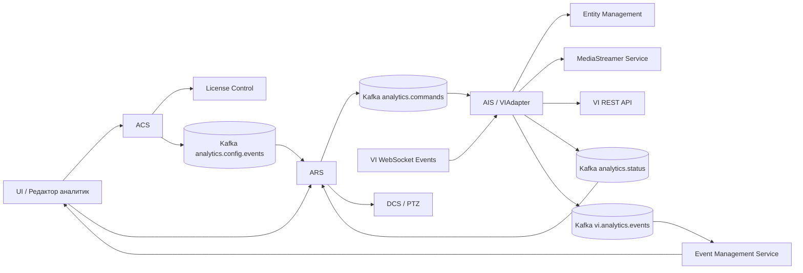
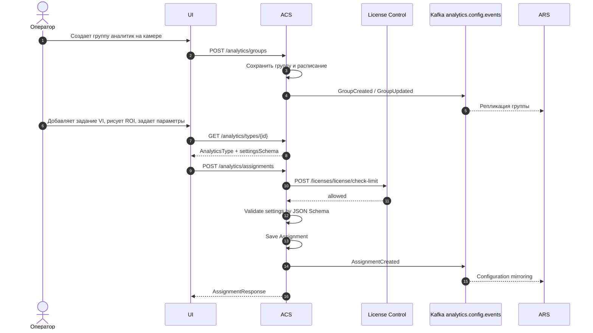
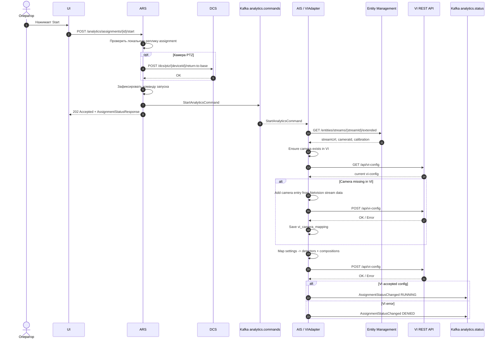
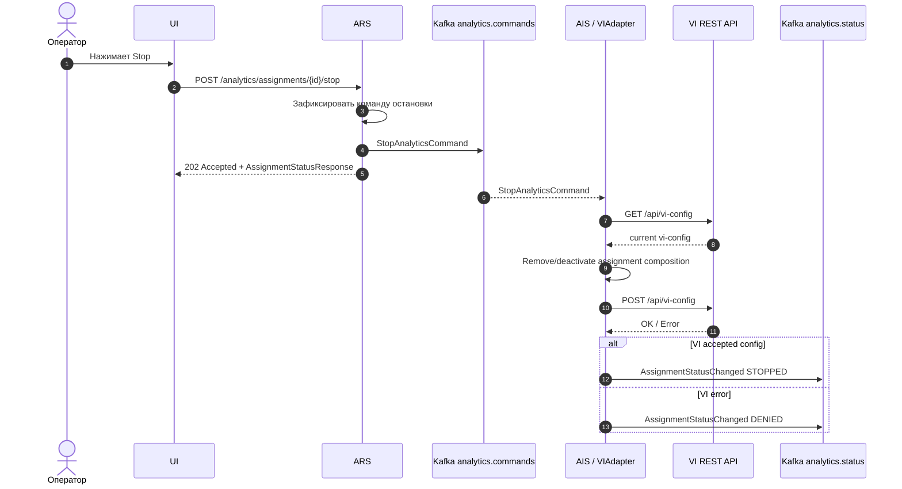
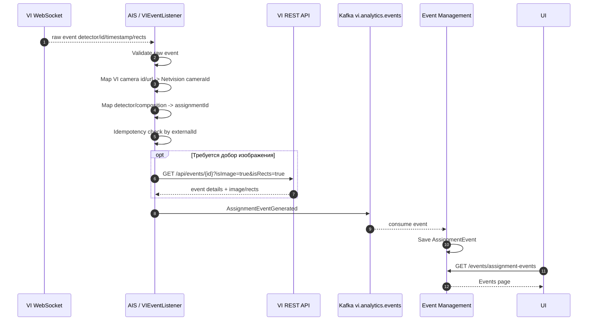
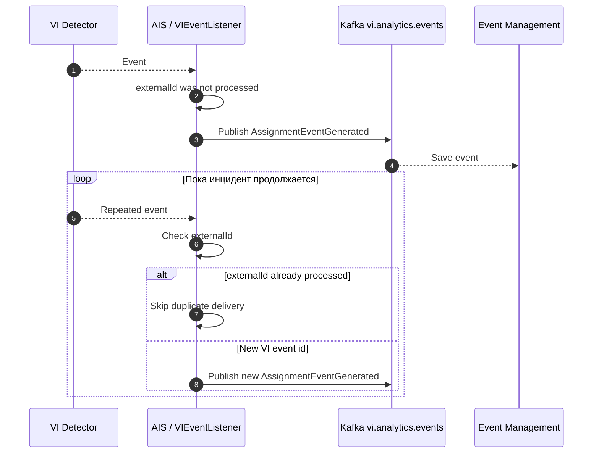

# Интеграция аналитик VI в платформу Netvision

## 1. Цель и Архитектурный Контекст

### 1.1. Бизнес-Цель

Проектирование сквозного процесса интеграции аналитик VI в платформу Netvision для задач безопасного города.

Главная бизнес-ценность: оператор платформы должен из единого интерфейса создавать, настраивать, запускать и останавливать задания видеоаналитики VI на камерах, а результаты сработок должны попадать в общий журнал событий Netvision как `AssignmentEvent`.

<span style="color:blue">Пользователь не должен заводить камеры в VI или другой сторонней платформе вручную. Netvision является основной системой управления камерами, потоками и аналитическими заданиями. VI используется как внешний движок видеоаналитики, техническая конфигурация которого поддерживается интеграцией автоматически.</span>

В рамках интеграции поддерживаются аналитики:

| Аналитика в Netvision | Detector VI | Назначение |
| --- | --- | --- |
| Движение в запрещенной зоне | `forbidden` | Тревога при движении/нахождении объекта в заданной зоне |
| Движение в запрещенном направлении | `direction` | Тревога при движении в запрещенном направлении в зоне или через линию |
| Оставленный предмет | `abandoned` / `abandoned2` | Детекция оставленных предметов, indoor/outdoor режимы |
| Драка / агрессивное поведение | `violence` | Детекция агрессивного поведения |

### 1.2. Концептуальное Разделение Сценариев

<span style="color:blue">**Сценарий 0. Автоматическое обеспечение наличия камеры в VI**</span>

<span style="color:blue">Пользователь работает только в Netvision. Он не создает камеры в VI вручную и не обязан знать, заведена ли камера во внешней системе.</span>

<span style="color:blue">Перед применением задания аналитики AIS через `VIAdapter` должен проверить наличие камеры в VI и при необходимости создать ее автоматически.</span>

<span style="color:blue">Общий процесс:</span>

<span style="color:blue">1. AIS получает из Entity Management данные камеры и потока: `cameraId`, `streamId`, `streamUrl`, имя камеры и параметры потока.</span>

<span style="color:blue">2. AIS проверяет локальный mapping `Netvision cameraId/streamId -> VI camera`.</span>

<span style="color:blue">3. AIS выполняет `GET /api/vi-config` и проверяет, существует ли камера в VI фактически.</span>

<span style="color:blue">4. Если mapping отсутствует или камера была удалена из VI, AIS пытается найти камеру в VI по `streamUrl` или metadata.</span>

<span style="color:blue">5. Если камера не найдена, AIS создает новую camera entry в `vi-config` на основе данных Netvision.</span>

<span style="color:blue">6. AIS сохраняет или обновляет `vi_camera_mapping`.</span>

<span style="color:blue">7. После этого AIS применяет настройки задания аналитики: `detectors` и `compositions`.</span>

<span style="color:blue">Этот подход соответствует паттерну других интеграций внешней видеоаналитики: платформа сама заводит техническую камеру во внешней системе, например через `POST /cameras/` в FindFace. Для VI аналогичная операция выполняется через read-modify-write `vi-config`, так как отдельный CRUD API камер в текущем контракте VI не зафиксирован.</span>

**Сценарий 1. Конфигурация аналитики**

Пользователь создает группу аналитик на камере, добавляет задание, выбирает тип аналитики VI, рисует ROI и задает параметры. ACS валидирует настройки по JSON Schema и сохраняет конфигурацию.

**Сценарий 2. Управление жизненным циклом**

Пользователь или планировщик ARS запускает/останавливает задание. ARS публикует команду в Kafka. AIS через `VIAdapter` применяет изменение во внешней системе VI через `GET /api/vi-config` и `POST /api/vi-config`.

<span style="color:blue">Перед применением задания AIS выполняет `ensureCameraInVI`: проверяет наличие камеры в VI и при необходимости создает ее.</span>

**Сценарий 3. Получение сработок**

AIS подписан на WebSocket VI и получает сырые события детекторов. AIS нормализует событие, сопоставляет с `assignmentId`, выполняет минимальную идемпотентность по внешнему идентификатору события и публикует событие в Kafka topic `vi.analytics.events` для сохранения в EMS.

**Сценарий 4. Длительные инциденты**

VI поддерживает параметры подавления повторных событий для ряда детекторов (`dead_time`, `dead_time_IOU`, `event_policy`). В текущей реализации платформа доверяет этим настройкам VI и не вводит сложную дедупликацию по геометрии рамок. Расширенная дедупликация остается опциональным развитием, если на стенде появится фактический поток дублей.

### 1.3. Роли Сервисов

**UI**

Показывает редактор аналитик, строит формы по `settingsSchema`, позволяет пользователю рисовать ROI, запускать/останавливать задания и просматривать журнал событий.

<span style="color:blue">UI не содержит сценариев ручного заведения камер в VI. Пользователь выбирает камеры и потоки из Netvision.</span>

**ACS (Analytics Configuration Service)**

Мастер конфигураций. Хранит каталог типов аналитик, JSON Schema настроек, группы аналитик, задания и расписания. Публикует изменения конфигурации в Kafka.

**ARS (Analytics Runtime Service)**

Оркестратор жизненного цикла. Хранит локальную реплику конфигураций, принимает команды start/stop от UI и планировщика, публикует команды в `analytics.commands`, получает фактические статусы из `analytics.status`.

**AIS (Analytics Integration Service)**

Интеграционный сервис и набор адаптеров. Для VI содержит `VIAdapter`, который инкапсулирует авторизацию, работу с `vi-config`, WebSocket-подписку на события, маппинг команд и нормализацию сработок.

<span style="color:blue">Для VI адаптер также отвечает за автоматическое обеспечение наличия камеры во внешней системе. AIS проверяет существующий mapping камеры, сверяет его с фактическим `vi-config` и при необходимости создает новую camera entry в VI через read-modify-write конфигурации.</span>

**Entity Management**

Источник камер, потоков и калибровки. AIS использует `streamId` для получения `streamUrl`, `cameraId`, имени камеры и параметров потока.

<span style="color:blue">Entity Management является master-системой по камерам и потокам. VI не является источником истины по камерам. AIS использует данные Entity Management для поиска или автоматического создания технической камеры в VI.</span>

**MediaStreamer Service**

Источник live/snapshot/archive URL для платформы. В интеграции VI используется как fallback-источник snapshot или архивных ссылок по внутреннему `streamId` и времени события, если VI не отдал изображение события.

**DCS (Device Control Service)**

Источник PTZ-состояния и команд возврата в базовое положение. Для ROI-аналитик запуск на PTZ-камере допустим только в базовом положении камеры; команды PTZ выполняются по `deviceId`.

**EMS (Event Management Service)**

Журнал событий. Сохраняет нормализованные `AssignmentEvent`, предоставляет UI список событий, карточку события, статусы обработки и preview.

**License Control**

Проверяет лимиты лицензии при создании задания аналитики.

**Kafka**

Асинхронная шина конфигураций, команд, статусов и событий. Для событий аналитики используется принятый vendor-specific topic: `{vendor}.analytics.events`, для VI - `vi.analytics.events`.

**VI**

Внешняя система видеоаналитики. Принимает конфигурацию через REST API и отдает сработки через WebSocket/REST.

<span style="color:blue">Камеры в VI рассматриваются как технические представления камер Netvision. Пользователь не обязан создавать или настраивать их в UI VI. Создание и актуализация camera entry выполняется интеграцией автоматически.</span>

### 1.4. Архитектурные Решения

1. Интеграция с VI выполняется только через REST/WebSocket API. VI SDK не используется.
2. `AnalyticsGroup` в Netvision остается логической группой заданий и носителем расписания.
3. `Assignment` в Netvision соответствует одному заданию аналитики VI.
4. Несколько ROI для одной аналитики хранятся внутри одного `Assignment.settings`, а не как отдельные задания.
5. Настройки UI всегда передают координаты ROI в нормализованном виде `0..1`.
6. AIS выполняет маппинг универсальной схемы ACS в VI `detectors.*`.
7. Включение/отключение всей аналитики на камере VI выполняется через `camera.enabled = true/false`.
8. Управление отдельными детекторами выполняется через `compositions`, так как отключать всю камеру для остановки одного задания нельзя.
9. Для `violence.minNumberOfObjects` обязательно использование `coco_object_counter`, иначе параметр не работает.
10. Если `violence.areas = []`, VI использует дефолтную зону, то есть весь кадр.
11. Для одной камеры допускается не более одного активного assignment одного VI detector type. Несколько ROI одного типа аналитики должны храниться внутри одного `Assignment.settings`.
12. <span style="color:blue">Пользователь не заводит камеры в VI вручную. Netvision / Entity Management является master-системой по камерам и потокам.</span>
13. <span style="color:blue">Перед запуском задания VIAdapter выполняет операцию `ensureCameraInVI`: проверяет наличие камеры в VI и при необходимости создает ее в `vi-config`.</span>
14. <span style="color:blue">Создание камеры в VI выполняется идемпотентно через read-modify-write `vi-config`, так как отдельный CRUD API для камер в текущем контракте VI не зафиксирован.</span>
15. <span style="color:blue">Mapping `Netvision cameraId/streamId -> VI cameraId/viCameraUrl` создается и поддерживается AIS автоматически.</span>
16. <span style="color:blue">Остановка assignment не удаляет камеру из VI. AIS удаляет или деактивирует только соответствующую `composition`; lifecycle cleanup неиспользуемых камер является отдельной технической политикой.</span>

## 2. Контракты Конфигурации и Бизнес-Маппинги

### 2.1. Общие Требования к JSON Schema

Все схемы сохраняются в ACS как `AnalyticsType.settingsSchema`.

Общие правила:

1. `Vendor = "VI"`.
2. `Name` хранит системное имя типа аналитики, `Title` хранит русское локализованное название для UI.
3. Каждый параметр, который отображается в редакторе, должен иметь русское `title`.
4. После каждой JSON Schema приводится таблица `Параметр / Название в UI` по формату `NP-A-778 (3).md`.
5. Координаты точек ROI нормализованы в диапазоне `0..1`.
6. `additionalProperties = false`.
7. Все параметры, влияющие на количество событий, должны быть явно представлены в UI: `deadTime`, `reactionTime`, `duration`, `detectionTime`.
8. Служебные параметры VI, которые не должны редактироваться оператором, задаются в AIS как дефолты.

### 2.2. Общие `$defs` Для ROI

```json
{
  "$defs": {
    "point": {
      "type": "object",
      "properties": {
        "x": { "type": "number", "minimum": 0, "maximum": 1 },
        "y": { "type": "number", "minimum": 0, "maximum": 1 }
      },
      "required": ["x", "y"],
      "additionalProperties": false
    },
    "zone": {
      "type": "object",
      "properties": {
        "id": { "type": "string" },
        "type": { "type": "string", "const": "zone" },
        "name": { "type": "string", "default": "" },
        "points": {
          "type": "array",
          "items": { "$ref": "#/$defs/point" },
          "minItems": 3
        }
      },
      "required": ["id", "type", "points"],
      "additionalProperties": false
    },
    "line": {
      "type": "object",
      "properties": {
        "id": { "type": "string" },
        "type": { "type": "string", "const": "line" },
        "name": { "type": "string", "default": "" },
        "directionType": {
          "type": "string",
          "title": "Направление контроля",
          "enum": ["Directed", "Bidirectional"]
        },
        "points": {
          "type": "array",
          "items": { "$ref": "#/$defs/point" },
          "minItems": 2,
          "maxItems": 2
        }
      },
      "required": ["id", "type", "directionType", "points"],
      "additionalProperties": false
    }
  }
}
```

### 2.3. `VIForbiddenZone`

Название аналитики в UI: **Движение в запрещенной зоне**.

| Параметр | Название в UI | Примечание |
| --- | --- | --- |
| `zones` | Запрещенные зоны | ROI, в которых движение людей считается нарушением |
| `reactionTime` | Время реакции, сек | Время нахождения/движения в зоне до тревоги |
| `minNumberOfObjects` | Минимальное количество людей | Порог по количеству людей в зоне |
| `sensitivity` | Чувствительность | Чувствительность детектора к движению |
| `headSize` | Размер головы | Оценочный размер головы человека относительно кадра |
| `deadTime` | Пауза между повторными событиями, сек | Мертвое время VI после сработки |

Маппинг в VI:

| Поле в универсальной схеме | Поле VI | Логика преобразования |
| --- | --- | --- |
| `zones.items[].points` | `detectors.forbidden.areas[].vertices` | Прямой маппинг нормализованных точек |
| `zones.items[].name` | не передается | Локальное имя ROI для UI/ACS |
| отсутствует | `detectors.forbidden.areas[].sensitivity` | Хардкод `"normal"` |
| `deadTime` | `detectors.forbidden.dead_time` | Прямой маппинг, секунды |
| `minNumberOfObjects` | `detectors.forbidden.minNumberOfObjects` | Прямой маппинг |
| `reactionTime` | `detectors.forbidden.reactiontime` | Прямой маппинг, секунды |
| `sensitivity` | `detectors.forbidden.sensitivity` | Прямой маппинг |
| `headSize` | `detectors.forbidden.sizeobject` | Прямой маппинг |

### 2.4. `VIForbiddenDirection`

Название аналитики в UI: **Движение в запрещенном направлении**.

| Параметр | Название в UI | Примечание |
| --- | --- | --- |
| `mode` | Режим работы | `line` - линия контроля, `area` - зона анализа |
| `zones` | Зоны анализа | ROI для режима `area` |
| `lines` | Запрещенные направления | Линии контроля для режима `line` |
| `lines.items[].directionType` | Направление контроля | `Directed` - в одном направлении, `Bidirectional` - в обоих направлениях |
| `angle` | Допустимый угол отклонения | Угол отклонения от заданного направления, градусы |
| `duration` | Продолжительность | Продолжительность движения в запрещенном направлении |
| `intensity` | Интенсивность движения | Порог заметности движения в условных единицах VI |
| `sensitivity` | Чувствительность | Чувствительность детектора в режиме линии |
| `headSize` | Размер головы | Оценочный размер головы человека относительно кадра |
| `minNumberOfObjects` | Минимальное количество людей | Порог по количеству людей |
| `deadTime` | Пауза между повторными событиями, сек | Мертвое время VI после сработки |

Маппинг в VI:

| Поле в универсальной схеме | Поле VI | Логика преобразования |
| --- | --- | --- |
| `mode` | `detectors.direction.type` | `line` или `area` |
| `zones.items[].points` | `detectors.direction.area.areas[].vertices` | Используется в режиме `area` |
| `lines.items[].points` | `detectors.direction.line.lines[].vertices` | Используется в режиме `line` |
| `lines.items[].directionType` | `detectors.direction.line.lines[].both` | `Bidirectional -> true`, `Directed -> false` |
| `angle` | `detectors.direction.area.angle` | Для режима `area` |
| `duration` | `detectors.direction.area.duration` | Для режима `area` |
| `intensity` | `detectors.direction.area.intensity` | Для режима `area`, шкала VI `0..10` |
| `headSize` | `detectors.direction.area.sizeobject` | Для режима `area` |
| `sensitivity` | `detectors.direction.line.sensitivity` | Для режима `line` |
| `minNumberOfObjects` | `detectors.direction.minNumberOfObjects` | Прямой маппинг |
| `deadTime` | `detectors.direction.dead_time` | Прямой маппинг, секунды |

### 2.5. `VIAbandonedObject`

Название аналитики в UI: **Детектор оставленных предметов**.

| Параметр | Название в UI | Примечание |
| --- | --- | --- |
| `sceneType` | Тип сцены | `Indoor` - помещение, `Outdoor` - улица |
| `zones` | Зоны детектирования | ROI, в которых ищем оставленные предметы |
| `detectionTime` | Время детектирования, сек | Время, после которого объект считается оставленным |
| `sensitivity` | Чувствительность | Чувствительность детектора |
| `deadTime` | Пауза между повторными событиями, сек | Мертвое время VI после сработки |
| `filterHumans` | Игнорировать предметы рядом с человеком | Маппинг в `isFilterHumans` |
| `minObjectSize` | Минимальный размер объекта | Для indoor - минимальный размер, для outdoor - минимальная площадь |
| `maxObjectSize` | Максимальный размер объекта | Для indoor - максимальный размер, для outdoor - максимальная ширина и высота |

Маппинг в VI:

| Поле в универсальной схеме | Поле VI | Логика преобразования |
| --- | --- | --- |
| `sceneType = Indoor` | `detectors.abandoned` | Используется indoor-версия |
| `sceneType = Outdoor` | `detectors.abandoned2` | Используется outdoor-версия |
| `zones.items[].points` | `detectors.abandoned*.areas[].vertices` | Прямой маппинг нормализованных точек |
| отсутствует | `detectors.abandoned*.areas[].sensitivity` | Хардкод `"normal"` |
| `detectionTime` | `detectors.abandoned.detectiontime` | Для indoor |
| `detectionTime` | `detectors.abandoned2.detection_time` | Для outdoor |
| `deadTime` | `detectors.abandoned*.dead_time` | Прямой маппинг, секунды |
| `filterHumans` | `isFilterHumans` | Прямой маппинг |
| `minObjectSize` | `objsizemin` / `minarea` | Indoor: `objsizemin`; outdoor: `minarea` |
| `maxObjectSize` | `objsizemax` / `maxwidth`, `maxheight` | Indoor: `objsizemax`; outdoor: `maxwidth` и `maxheight` |
| `sensitivity` | `detectors.abandoned.sensitivity` | Indoor: `0..1` |
| `sensitivity` | `detectors.abandoned2.sensitivity` | Outdoor: AIS пересчитывает при необходимости к шкале VI |

### 2.6. `VIViolence`

Название аналитики в UI: **Детектор драки / агрессивного поведения**.

| Параметр | Название в UI | Примечание |
| --- | --- | --- |
| `zones` | Зоны детектирования | Если список зон пустой, VI анализирует весь кадр |
| `duration` | Продолжительность до тревоги, сек | Время агрессивного поведения до генерации тревоги |
| `sensitivity` | Чувствительность | Чувствительность детектора к движущимся объектам |
| `intensity` | Интенсивность | Порог заметности агрессивного поведения |
| `minNumberOfObjects` | Минимальное количество людей | Работает только при добавлении `coco_object_counter` |
| `deadTime` | Пауза между повторными событиями, сек | Мертвое время VI после сработки |

Маппинг в VI:

| Поле в универсальной схеме | Поле VI | Логика преобразования |
| --- | --- | --- |
| `zones.items[]` пустой | `detectors.violence.areas = []` | VI использует дефолтную зону на весь кадр |
| `zones.items[].points` | `detectors.violence.areas[].vertices` | Если пользователь нарисовал ROI |
| `duration` | `detectors.violence.duration` | Прямой маппинг, секунды |
| `sensitivity` | `detectors.violence.sensitivity` | Прямой маппинг, `0..1` |
| `intensity` | `detectors.violence.intensity` | Прямой маппинг, `0..1` |
| `minNumberOfObjects` | `detectors.violence.minNumberOfObjects` | Прямой маппинг, работает только с `coco_object_counter` |
| `deadTime` | `detectors.violence.dead_time` | Прямой маппинг, секунды |
| отсутствует | `detectors.violence.allowed_cuda` | Хардкод `true` или значение из технической конфигурации AIS |
| отсутствует | `detectors.violence.is_primary_debug_img` | Хардкод `false` |
| отсутствует | `detectors.violence.regulation` | Хардкод `""` |
| `minNumberOfObjects > 0` | `detectors.coco_object_counter` | AIS добавляет счетчик людей |
| `minNumberOfObjects > 0` | `compositions.<name>` | Composition содержит `violence` и `coco_object_counter` |

### 2.7. Внешние Методы VI

| Назначение | Метод VI | Использование |
| --- | --- | --- |
| Авторизация | `POST /api/auth/login` | Получение bearer token для REST |
| Обновление token | `PUT /api/auth/token` / refresh endpoint | Поддержание REST-сессии |
| Получить конфигурацию | `GET /api/vi-config` | Read phase перед изменением |
| Применить конфигурацию | `POST /api/vi-config` | Write phase после маппинга задания |
| <span style="color:blue">Создать или актуализировать камеру</span> | <span style="color:blue">`GET /api/vi-config` + `POST /api/vi-config`</span> | <span style="color:blue">AIS добавляет или обновляет camera entry в общей конфигурации VI, если камера Netvision еще не представлена в VI</span> |
| Получить параметр детектора | `GET /api/vi-config/camera-setting/{id}` | Диагностика и точечная проверка |
| Онлайн события | `ws://<host>:9004/?with_frames=0/1` | Основной канал событий от `svc.processing` |
| Архивные события | `ws://<host>:3000/?with_frames=0/1` | Канал событий от `svc.archive` |
| Получить событие | `GET /api/events/{id}` | Добор данных по событию |
| Получить изображение события | `GET /api/v1/events/{id}/imageByTime` | Добор изображения по `id` и `time` |
| Получить rects | `GET /api/events/{id}/rects` | Добор рамок события |

### 2.8. Управление `vi-config`

Так как VI не предоставляет отдельный CRUD API для задания аналитики, `VIAdapter` применяет изменения через read-modify-write конфигурации.

<span style="color:blue">Так как в текущем контракте также не зафиксирован отдельный CRUD API для камер VI, создание или актуализация камеры выполняется тем же механизмом: `GET /api/vi-config` -> изменение конфигурации -> `POST /api/vi-config`.</span>

Алгоритм:

1. Получить команду `StartAnalyticsCommand` или `StopAnalyticsCommand`.
2. Получить локальный lock на пару `viInstanceId + cameraId + streamId`.
3. <span style="color:blue">Получить из Entity Management данные камеры и потока: `cameraId`, `streamId`, `streamUrl`, имя камеры, параметры потока.</span>
4. Выполнить `GET /api/vi-config`.
5. <span style="color:blue">Выполнить `ensureCameraInVI`:</span>
   - <span style="color:blue">проверить `vi_camera_mapping`;</span>
   - <span style="color:blue">проверить наличие камеры в текущем `vi-config`;</span>
   - <span style="color:blue">если mapping отсутствует, попытаться найти камеру по `streamUrl` / metadata;</span>
   - <span style="color:blue">если камера не найдена, добавить новую camera entry в `config.configurations.Default.cameras`;</span>
   - <span style="color:blue">сохранить или обновить `vi_camera_mapping`.</span>
6. Найти камеру VI по актуальному mapping `Netvision.cameraId/streamId -> VI.camera.id/url`.
7. Изменить `detectors` и `compositions`.
8. Выполнить `POST /api/vi-config`.
9. Проверить результат и опубликовать статус в `analytics.status`.

Правила:

1. `camera.enabled = false` используется только для остановки всей аналитики камеры.
2. Остановка отдельного задания выполняется удалением или деактивацией соответствующей `composition`.
3. Detector config можно оставлять в `detectors`, если он не используется ни одной активной composition.
4. Для предотвращения конфликтов все изменения одной VI-камеры сериализуются через lock.
5. <span style="color:blue">Создание камеры должно быть идемпотентным: повторный `StartAnalyticsCommand` не должен создавать дубликат камеры в VI.</span>
6. <span style="color:blue">Все операции создания или поиска камеры сериализуются через lock `viInstanceId + cameraId + streamId`.</span>
7. <span style="color:blue">Если камера была удалена из VI вручную, AIS должен считать mapping устаревшим, пересоздать camera entry и обновить `vi_camera_mapping`.</span>
8. <span style="color:blue">RTSP URL с учетными данными не логируется. В логах допускается только маскированное представление URL.</span>

## 3. Сценарии Взаимодействия

### 3.1. Общая Диаграмма Компонентов



### 3.2. Сценарий: Создание Группы и Задания Аналитики



### <span style="color:blue">3.2.1. Сценарий: Автоматическое создание камеры в VI</span>

<pre style="color:blue"><code class="language-mermaid">sequenceDiagram
    autonumber

    participant ARS as ARS
    participant Kafka as Kafka analytics.commands
    participant AIS as AIS / VIAdapter
    participant Entity as Entity Management
    participant VI as VI REST API

    ARS-&gt;&gt;Kafka: StartAnalyticsCommand
    Kafka--&gt;&gt;AIS: StartAnalyticsCommand

    AIS-&gt;&gt;Entity: GET /entities/streams/{streamId}/extended
    Entity--&gt;&gt;AIS: cameraId, streamId, streamUrl, cameraName, calibration

    AIS-&gt;&gt;AIS: Acquire lock viInstanceId + cameraId + streamId
    AIS-&gt;&gt;AIS: Check vi_camera_mapping

    AIS-&gt;&gt;VI: GET /api/vi-config
    VI--&gt;&gt;AIS: current vi-config

    alt Camera exists in VI
        AIS-&gt;&gt;AIS: Use existing viCameraId
    else Camera is missing
        AIS-&gt;&gt;AIS: Add camera entry to vi-config
        AIS-&gt;&gt;VI: POST /api/vi-config
        VI--&gt;&gt;AIS: OK / Error
        AIS-&gt;&gt;AIS: Save vi_camera_mapping
    end

    AIS-&gt;&gt;AIS: Continue assignment mapping to detectors + compositions
</code></pre>

### 3.3. Сценарий: Ручной Запуск Задания VI



### 3.4. Сценарий: Остановка Одного Задания



### 3.5. Сценарий: Получение Сработки от VI



### 3.6. Сценарий: Длительный Инцидент и Повторные События



Примечание: в текущей реализации платформа не объединяет разные события VI в один длительный инцидент по геометрии рамок или временным окнам. Частота генерации повторных тревог управляется настройками VI, в первую очередь `dead_time`. Расширенная дедупликация может быть добавлена позже по результатам нагрузочного тестирования на реальных потоках VI.

## 4. Межсервисное Взаимодействие (Kafka)

### 4.1. `analytics.config.events`

События конфигурации от ACS.

| Событие | Payload | Получатель | Действие |
| --- | --- | --- | --- |
| `AssignmentCreated` | `{ assignmentId, groupId, cameraId, streamId, typeId, typeName, vendor, settings }` | ARS | Сохранить локальную реплику |
| `AssignmentUpdated` | `{ assignmentId, settings, schemaVersion }` | ARS | Обновить локальную реплику |
| `AssignmentDeleted` | `{ assignmentId }` | ARS | Удалить/пометить задание |
| `GroupUpdated` | `{ groupId, cameraId, schedule }` | ARS | Обновить расписание |

### 4.2. `analytics.commands`

Команды от ARS к AIS.

#### `StartAnalyticsCommand`

```json
{
  "commandId": "uuid",
  "assignmentId": "uuid",
  "groupId": "uuid",
  "cameraId": "uuid",
  "streamId": "uuid",
  "vendor": "VI",
  "typeName": "VIViolence",
  "settings": {},
  "requestedAt": "2026-06-07T13:00:00Z"
}
```

Действие AIS: <span style="color:blue">обеспечить наличие камеры в VI,</span> применить `settings` к `vi-config`, добавить/обновить `detectors` и `compositions`, опубликовать статус.

#### `StopAnalyticsCommand`

```json
{
  "commandId": "uuid",
  "assignmentId": "uuid",
  "cameraId": "uuid",
  "streamId": "uuid",
  "vendor": "VI",
  "requestedAt": "2026-06-07T13:05:00Z"
}
```

Действие AIS: удалить/деактивировать composition задания в `vi-config`, опубликовать статус.

### 4.3. `analytics.status`

Обратная связь от AIS к ARS.

| Событие | Payload | Действие ARS |
| --- | --- | --- |
| `AssignmentStatusChanged` | `{ assignmentId, status, lastError, changedAt }` | Обновить runtime status |

Статусы:

| Статус | Значение |
| --- | --- |
| `NOT_STARTED` | Задание еще не запускалось или не имеет активного runtime-состояния |
| `RUNNING` | Конфигурация успешно применена в VI |
| `STOPPED` | Задание остановлено |
| `DENIED` | VI отклонил конфигурацию или недоступен |

### 4.4. `vi.analytics.events`

Нормализованные события аналитики.

#### `AssignmentEventGenerated`

`AssignmentEventGenerated` - единое имя сообщения для создания события аналитики в Event Management. Для VI не вводится отдельное имя события; vendor определяется полем `vendor = "VI"` и topic `vi.analytics.events`.

```json
{
  "eventId": "uuid",
  "externalId": "vi-event-id-or-rect-uuid",
  "assignmentId": "uuid",
  "cameraId": "uuid",
  "streamId": "uuid",
  "vendor": "VI",
  "eventType": "Violence",
  "eventSubType": "violence",
  "timestamp": 1765890991041,
  "severity": "High",
  "details": {
    "detector": "violence",
    "viCameraId": "e69d117d-64f4-40ef-a39b-b2a6625ab6cc",
    "rects": [
      {
        "x": 0.410416663,
        "y": 0.667592585,
        "w": 0.026041666,
        "h": 0.0972222239,
        "duration": 1500,
        "uuid": "8b494c63-0c5c-4218-ae99-761cd98aa1ae"
      }
    ],
    "raw": {}
  },
  "preview": "optional-preview-path"
}
```

Действие EMS: сохранить событие как `AssignmentEvent`. Для публичного API EMS поле `details` хранится как строка, поэтому объект `details` из Kafka сериализуется в JSON-строку.

## 5. Внешнее Взаимодействие с VI

### 5.1. Авторизация

AIS хранит параметры подключения к VI instance:

```json
{
  "baseUrl": "http://vi-host:3030",
  "eventsProcessingWs": "ws://vi-host:9004/?with_frames=0",
  "eventsArchiveWs": "ws://vi-host:3000/?with_frames=0",
  "username": "admin",
  "passwordSecretRef": "secret-ref"
}
```

Правила:

1. REST-запросы используют bearer token VI.
2. WebSocket `svc.processing` использует Basic Authorization, если это требуется конкретным endpoint VI.
3. Секреты не хранятся в settings задания ACS.

### 5.2. WebSocket Подписка на События

VI документация не задает фиксированное время жизни WebSocket-соединения. Для интеграции соединение считается долгоживущим: `VIEventListener` держит постоянное подключение к `svc.processing` и выполняет reconnect с backoff при разрыве.

Правила масштабирования:

1. На один `viInstanceId` должен быть только один активный `VIEventListener`.
2. Если AIS запущен в нескольких репликах, активный listener выбирается через distributed lock/lease или leader election.
3. Остальные реплики AIS могут обрабатывать команды start/stop, но не должны параллельно читать тот же WebSocket поток событий.
4. Идемпотентность по `externalId` остается обязательной страховкой от повторной доставки, но не заменяет ограничение одного active listener на VI-инстанс.
5. При появлении нескольких VI-инстансов масштабирование выполняется по ключу `viInstanceId`.

### 5.3. Mapping Камер

<span style="color:blue">Netvision / Entity Management является master-системой по камерам и потокам. VI содержит техническую копию камеры, необходимую для работы внешней аналитики. Пользователь не должен создавать камеру в VI вручную.</span>

<span style="color:blue">AIS должен не только сопоставлять камеры Netvision и VI, но и обеспечивать наличие камеры в VI перед применением задания аналитики.</span>

Основной вариант сопоставления:

| Netvision | VI |
| --- | --- |
| `cameraId` | `config.configurations.Default.cameras[].id` или metadata mapping |
| `streamUrl` | `cameras[].url` |
| `streamId` | `cameras[].url` или metadata mapping |

<span style="color:blue">Если камера Netvision еще не представлена в VI, AIS создает новую camera entry в `vi-config` на основе данных Entity Management.</span>

Минимальная таблица AIS `vi_camera_mapping`:

| Поле | Назначение |
| --- | --- |
| `id` | Внутренний идентификатор записи |
| `viInstanceId` | Идентификатор инстанса VI |
| `cameraId` | Внутренний идентификатор камеры Netvision |
| `streamId` | Внутренний идентификатор видеопотока Netvision |
| `viCameraId` | Идентификатор камеры в `vi-config` |
| `viCameraUrl` | URL камеры в VI, используется для сопоставления событий по `url` |
| <span style="color:blue">`status`</span> | <span style="color:blue">Состояние mapping: `ACTIVE`, `STALE`, `FAILED`</span> |
| <span style="color:blue">`lastSyncError`</span> | <span style="color:blue">Последняя ошибка синхронизации камеры с VI</span> |
| `createdAt` | Дата создания записи |
| `updatedAt` | Дата обновления записи |

Ограничения:

1. `viInstanceId + cameraId + streamId` уникальны.
2. `viInstanceId + viCameraId` уникальны.
3. RTSP URL с паролями не логируется и хранится только в защищенном виде или в маскированном представлении.
4. <span style="color:blue">Создание камеры в VI должно быть идемпотентным.</span>
5. <span style="color:blue">Если mapping существует, но камера отсутствует в актуальном `vi-config`, AIS помечает mapping как `STALE`, пересоздает камеру и обновляет mapping.</span>
6. <span style="color:blue">Остановка или удаление assignment не удаляет камеру из VI автоматически.</span>

### 5.4. Mapping Заданий

Для обратного сопоставления события VI с заданием Netvision AIS хранит runtime mapping:

```json
{
  "assignmentId": "uuid",
  "cameraId": "uuid",
  "streamId": "uuid",
  "viCameraId": "uuid",
  "viDetectorName": "violence",
  "viCompositionName": "nv-<assignmentId>-violence",
  "eventType": "Violence"
}
```

Минимальная таблица AIS `vi_assignment_mapping`:

| Поле | Назначение |
| --- | --- |
| `id` | Внутренний идентификатор записи |
| `assignmentId` | Идентификатор задания ACS |
| `cameraId` | Внутренний идентификатор камеры Netvision |
| `streamId` | Внутренний идентификатор видеопотока Netvision |
| `viInstanceId` | Идентификатор инстанса VI |
| `viCameraId` | Идентификатор камеры в VI |
| `viDetectorName` | Имя detector в VI: `forbidden`, `direction`, `abandoned`, `abandoned2`, `violence` |
| `viDetectorType` | Бизнес-тип detector для ограничений: `forbidden`, `direction`, `abandoned`, `violence` |
| `viCompositionName` | Имя composition, созданной AIS для задания |
| `isActive` | Признак активного задания в VI |
| `createdAt` | Дата создания записи |
| `updatedAt` | Дата обновления записи |

Ограничения:

1. `assignmentId` уникален.
2. Для одной камеры допускается не более одного активного assignment одного `viDetectorType`.
3. `abandoned` и `abandoned2` считаются одним бизнес-типом `abandoned`, поэтому на одной камере не должно быть двух активных заданий "Оставленный предмет".
4. Если VI-событие не содержит имя composition, AIS сопоставляет событие по паре `viCameraId + viDetectorType`.
5. Несколько ROI одного типа аналитики должны храниться внутри одного assignment.

Минимальная таблица AIS `processed_external_events` для идемпотентности событий:

| Поле | Назначение |
| --- | --- |
| `id` | Внутренний идентификатор записи |
| `viInstanceId` | Идентификатор инстанса VI |
| `externalId` | `event.id` VI или `rect.uuid`, если `event.id` отсутствует |
| `assignmentId` | Идентификатор задания ACS |
| `viDetectorName` | Имя detector в VI |
| `createdAt` | Дата фиксации обработанного события |

Ограничение уникальности: `viInstanceId + assignmentId + externalId`.

### 5.5. Preview, Snapshot и Архивные Ссылки

Сопоставление изображения карточки события выполняется от события VI к внутренней камере и потоку:

```text
VI event id/url/viCameraId -> vi_camera_mapping -> cameraId/streamId
```

Правила:

1. Если VI отдает изображение события через `GET /api/v1/events/{id}/imageByTime` или событие пришло с кадром, AIS использует изображение VI как `preview`.
2. Если VI изображение недоступно, AIS получает snapshot из платформы по `streamId` и `timestamp` через MediaStreamer/StreamerBalancer.
3. Архивная ссылка строится по `streamId` и времени события, например `timestamp - N секунд` / `timestamp + N секунд`, через существующий сервис архива/streamer.
4. BBOX из `details.rects` точнее всего соответствует изображению VI. При использовании snapshot из платформы возможна небольшая рассинхронизация кадра, но координаты остаются нормализованными `0..1` и масштабируются на отображаемое изображение.
5. В публичном API EMS поле `AssignmentEvent.details` является строкой. Frontend карточки инцидента парсит `details` как JSON и использует `details.rects` для отрисовки BBOX поверх картинки из `AssignmentEvent.preview`.

## 6. Идемпотентность, Ошибки и Повторные События

### 6.1. Идемпотентность Команд

AIS хранит обработанные `commandId`.

Правила:

1. Повторный `StartAnalyticsCommand` с тем же `commandId` не применяет `vi-config` повторно.
2. Повторный `StartAnalyticsCommand` для уже активного задания возвращает текущий `RUNNING`.
3. Повторный `StopAnalyticsCommand` для уже остановленного задания возвращает `STOPPED`.
4. <span style="color:blue">Повторная обработка `StartAnalyticsCommand` не должна создавать дубликат камеры в VI.</span>
5. <span style="color:blue">Операция `ensureCameraInVI` должна использовать устойчивый ключ `viInstanceId + cameraId + streamId`.</span>
6. <span style="color:blue">Если камера уже существует в VI по `viCameraId` или `streamUrl`, AIS должен переиспользовать ее и только актуализировать `vi_camera_mapping`.</span>

### 6.2. Ошибки VI

| Ошибка | Поведение AIS | Статус ARS |
| --- | --- | --- |
| VI недоступен | Retry с backoff, затем failure | `DENIED` |
| Ошибка авторизации | Refresh token, retry | `DENIED` после исчерпания |
| Некорректный config | Не применять повторно, логировать raw error | `DENIED` |
| Конфликт обновления config | Повторить read-modify-write под lock | Текущий статус сохраняется до результата |
| WebSocket отключился | Reconnect loop | Статус заданий не меняется автоматически |
| <span style="color:blue">Камера отсутствует в VI</span> | <span style="color:blue">AIS пытается создать camera entry через `vi-config`, затем повторяет применение задания</span> | <span style="color:blue">`RUNNING` при успехе, `DENIED` при ошибке создания</span> |
| <span style="color:blue">Mapping указывает на несуществующую VI camera</span> | <span style="color:blue">Пометить mapping как `STALE`, найти камеру по `streamUrl` или пересоздать ее</span> | <span style="color:blue">`RUNNING` при восстановлении, `DENIED` при ошибке</span> |
| <span style="color:blue">Конфликт параллельного создания камеры</span> | <span style="color:blue">Сериализовать через lock `viInstanceId + cameraId + streamId`, повторить read-modify-write</span> | <span style="color:blue">Текущий статус сохраняется до результата</span> |

### 6.3. Текущая Реализация: Идемпотентность Событий

В текущей реализации AIS не выполняет расширенную дедупликацию событий по геометрии рамок, IoU, временным окнам или признакам длительного инцидента.

Минимальная защита нужна только от повторной доставки одного и того же события VI, например после переподключения WebSocket или повторной обработки сообщения.

Ключ идемпотентности:

```text
vendor + viCameraId + assignmentId + detector + externalId
```

Правила:

1. `externalId` формируется из `event.id`, если VI передал идентификатор события.
2. Если отдельного `event.id` нет, допускается использовать `rect.uuid`.
3. Если событие с таким ключом уже обработано, AIS не публикует повторный `AssignmentEventGenerated`.
4. Если VI генерирует новое событие с новым `externalId`, AIS считает его самостоятельной сработкой и публикует в Kafka.
5. Частота повторных тревог управляется настройками VI, например `dead_time`.

### 6.4. Опциональное Развитие: Расширенная Дедупликация

Этот раздел не входит в текущую реализацию. Он фиксирует возможное развитие, если на стенде VI будет обнаружен поток повторных событий, которые имеют разные `externalId`, но фактически относятся к одному длительному инциденту.

Потенциальный ключ расширенной дедупликации:

```text
vendor + viCameraId + assignmentId + detector + rounded(rect) + timeBucket
```

Потенциальные правила:

1. Берется из `settings.deadTime`, если задан.
2. Если `deadTime = 0`, используется платформенный default, например 5 секунд.
3. Для `abandoned` можно учитывать `dead_time_IOU` при совпадении рамок.
4. Для близких рамок в одном временном окне можно подавлять повторную публикацию.

Решение о реализации этого механизма принимается только после тестирования реального поведения VI. По умолчанию платформа доверяет механизмам VI (`dead_time`, `reactiontime`, `duration`, `event_policy`) и не усложняет AIS.

## 7. Нефункциональные Требования

### 7.1. Производительность

1. Команда start/stop в ARS должна возвращать `AssignmentStatusResponse` без ожидания применения `vi-config` в VI.
2. AIS должен применять `vi-config` асинхронно.
3. Обработка одного WebSocket события до публикации в Kafka должна занимать менее 500 мс без добора изображения.
4. <span style="color:blue">Операция `ensureCameraInVI` выполняется в рамках асинхронной обработки команды запуска и не должна блокировать ответ UI на команду `start`.</span>

### 7.2. Надежность

1. AIS должен автоматически переподключаться к WebSocket VI.
2. Для каждого `viInstanceId` должен быть только один активный WebSocket listener; при нескольких репликах AIS используется distributed lock/lease.
3. При рестарте AIS восстанавливает active mappings из локального хранилища или из ARS/ACS реплики.
4. Все изменения `vi-config` сериализуются по VI camera id.
5. <span style="color:blue">Все операции создания камеры в VI сериализуются по ключу `viInstanceId + cameraId + streamId`, чтобы исключить дубли при параллельных запусках.</span>

## 8. Audit и License

### 8.1. License

ACS при создании задания вызывает:

```http
POST /licenses/license/check-limit
```

Пример:

```json
{
  "requestedFeature": "Analytics.VI",
  "currentCount": 10,
  "requestedCount": 1
}
```

Точное имя `requestedFeature` определяется настройками лицензирования продукта.

### 8.2. Audit

Аудиту подлежат:

1. Создание/обновление/удаление задания VI.
2. Ручной start/stop.
3. Ошибки применения конфигурации VI.
4. Ручное изменение статуса события оператором в EMS.
5. <span style="color:blue">Автоматическое создание камеры в VI.</span>
6. <span style="color:blue">Восстановление mapping после удаления камеры из VI.</span>
7. <span style="color:blue">Ошибки синхронизации камеры Netvision с VI.</span>

## 9. Ограничения

1. VI управляет аналитикой через общий `vi-config`, а не через отдельный task API.
2. На одной камере запрещено иметь более одного активного assignment одного VI detector type; иначе при отсутствии composition name в событии VI невозможно надежно сопоставить сработку с заданием.
3. Для `violence.minNumberOfObjects` требуется `coco_object_counter`.
4. `camera.enabled = false` отключает всю аналитику камеры, поэтому не используется для остановки отдельного задания.
5. Для PTZ-камер ROI валиден только в базовом положении камеры.
6. <span style="color:blue">Пользователь не должен создавать камеры в VI вручную. Интеграция обязана автоматически обеспечить наличие камеры в VI.</span>
7. <span style="color:blue">Создание камеры в VI выполняется через общий `vi-config`, если отдельный CRUD API камер недоступен или не используется.</span>
8. <span style="color:blue">Камера в VI является технической копией камеры Netvision. Источником истины по камерам, потокам и именам остается Entity Management.</span>
9. <span style="color:blue">Удаление задания аналитики не означает автоматическое удаление камеры из VI.</span>

